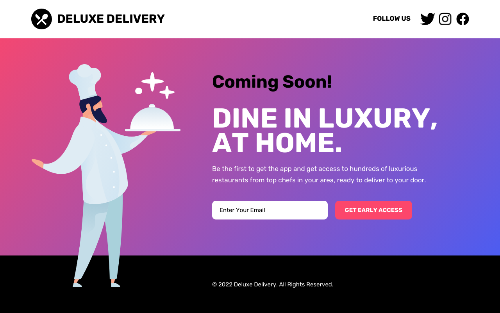

# Deluxe-Delivery-Landing-Page

Esta foi minha tentativa de reprodução de um projeto landing page.

Aprendi um pouco sobre HTML Semântico, além de alguns outros conceitos de CSS, como Position Relative, que acabou ficando fora do projeto final.

Também utilizei sites que ajudam no background gradiente por exemplo, além de conversores de px para rem, color picker e outros.

Projeto base:

O próximo passo é tornar o site responsivo!
